# Kasus 1: Program Pemesanan Tiket Bioskop
## Lankah Lankah Pembuatanya 
### 1. Buatkan folder baru di file manager dengan nama labpy02
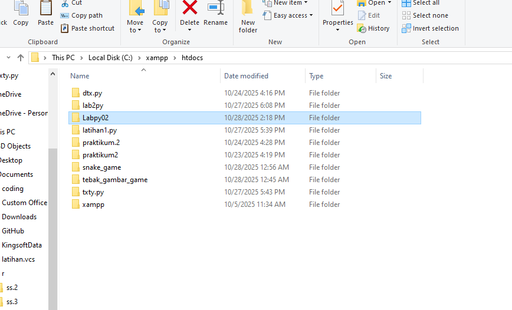
### 2. Ketika sudah membuat folder baru, buatkan lagi file baru di folder labpy02 tadi dengan mengklik sehingga masuk, kemudian buatkan file baru di bagian itu, klik bagian new dan tambahkan text dukumen dan buat jadi file kasus1.py tambahkan juga kasus2.py pada bagian folder tersebut
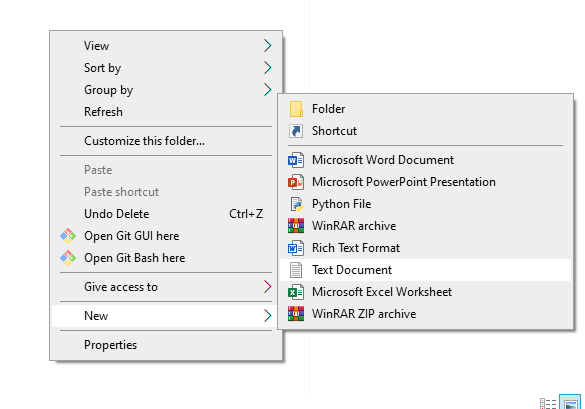
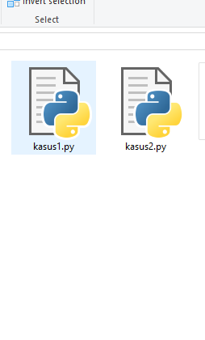
### 3. setelah buat folder baru dan filenya, selanjutnya Masuk ke VISUAL STUDIO CODE di laptop 
### Ketika sudah masuk, klik bagian kiri paling atas pada menu file dan buka bagian menu open folder
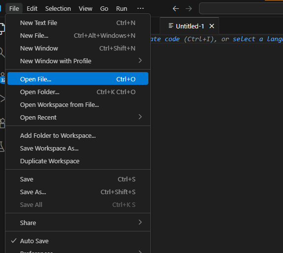
###  Maka akan masuk ke bagian file manager seperti di bawah ini, cari bagian folder labpy02 yang baru di buat, klik bagian Folder labpy02 dengan sekali klik, kemudian muncul select folder dan klik select folder tersebut.
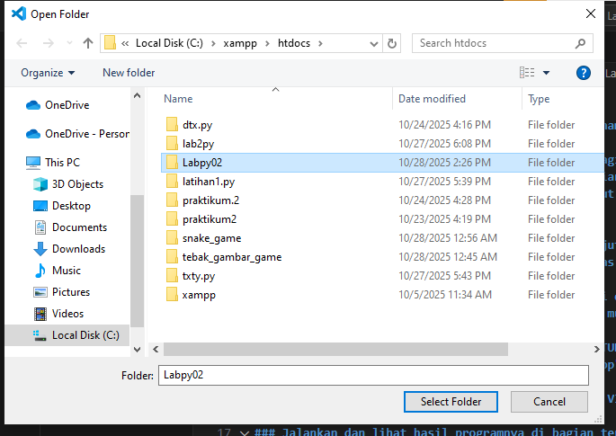
### 4. Setelah itu file akan tersimpan di VISUAL STUDIO CODE
### Kamudian buatkan "proram Pemesanan Tiket Bioskop" pada file kasus1.py tersebut
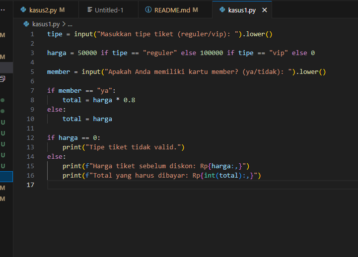
### 5. jalankan programnya di bagian menu run pada VISUAL STUDIO CODE pada bagian atas kanan program, atau masukan kode foldernya di bagian terminal "python labpy02.py"
### Jalankan dan lihat hasil programnya di bagian terminal.
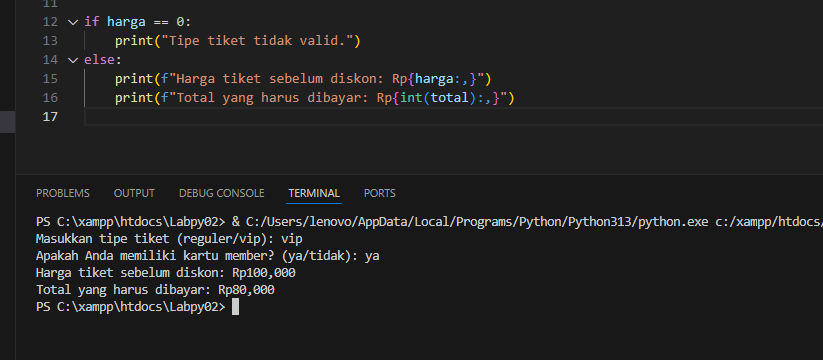
### 6. Bagian flowcart
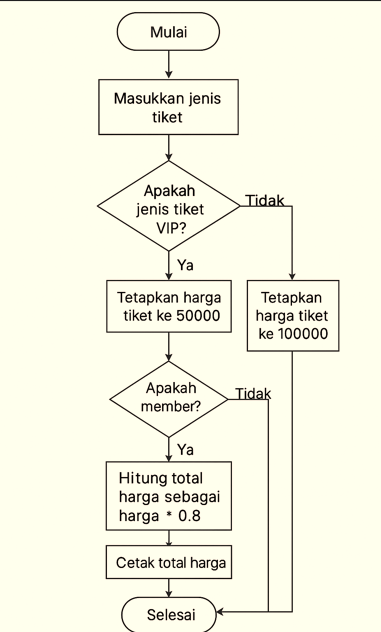

# Kasus 2: Program Kalkulator Sederhana
## Lankah-Lankah Pembuatnya
### 1. Masukan kedalam folder yang sama dan buatkan file baru pada bagian folder itu seperti pada penjelasan kasus 1
### 2. Karena foldernya pada lab02.py sudah tersimpan bersamaan dengan file "kasus1.py" dan "kasus2.py", Maka langsung masuk saja ke Visual Studio Code 
### 3. setelah masuk di Visual Studio maka klik pada pada kasus2.py yang sudah tersimpan di bagian kiri folder 
### 4. Kemudian langsung jalankan program kasus2.py tersebut 
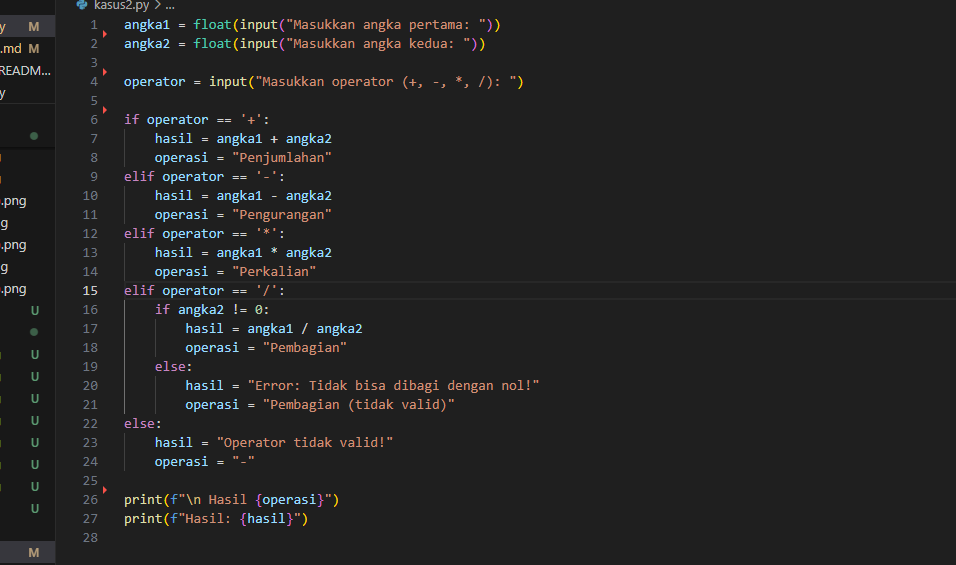
### Jalankan programnya di bagian terminal, caranya sama seperti kasus1.py
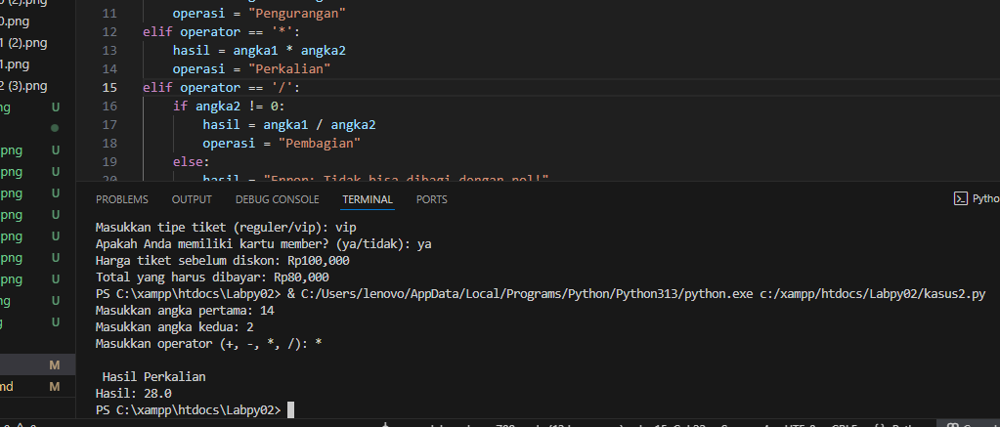
### Bagian flowcart flowcart
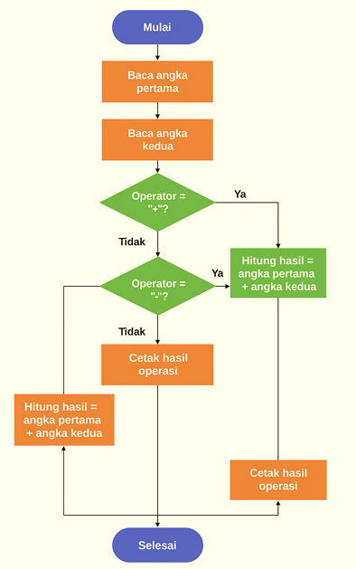

## Setelah kasus 1 dan 2 selesai selanjutnya Commit dan push pada repository
### 1. Masuk pada akun github buatkan new repository pada akun GitHub
### klik bagian new pada warna hijau tersebut
### atau klik pada bagian profil kanan atas, disitu ada bagian repositorynya 
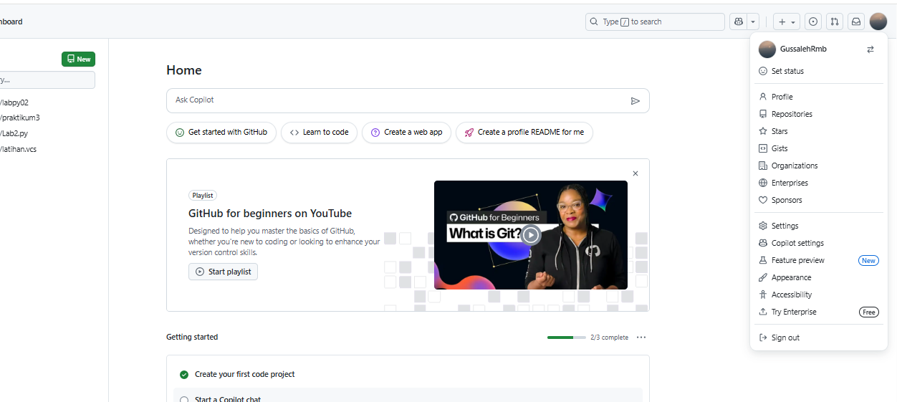
### setelah itu buatkan nama file repositorinya pada bagian "Repository name" dan klik pada menu bagian bawah warna hijau "create repository"
.png>)
### maka repositorinya akan meminta file yang kita commit dan push dari project labpy02 yang sudah kita buat  
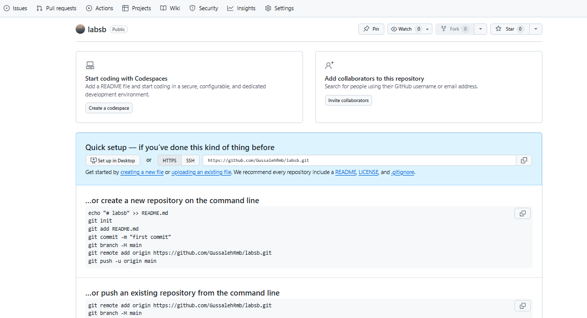
### selanjutnya kita masuk kembali ke visual studio code (VSC) untuk menjalankan lewat terminal/git bash dari repository yang kita buat  "disini saya menjalankan menggunakan terminal dari VS Codenya sendiri"
### klik titik 3 bagian atas, kemudian geser kebagian terminal dan klik new terminal
.png>)
### Terakhir jalankan code terminalnya buat commit dan push ke repository yang baru di buat

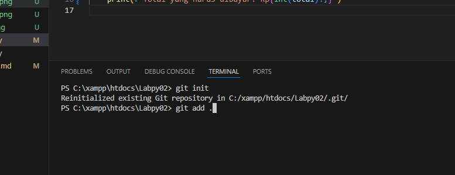
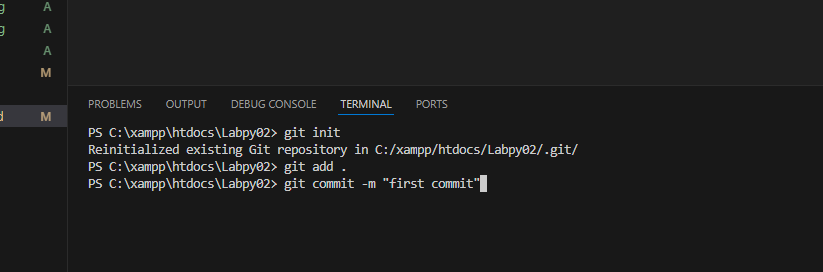
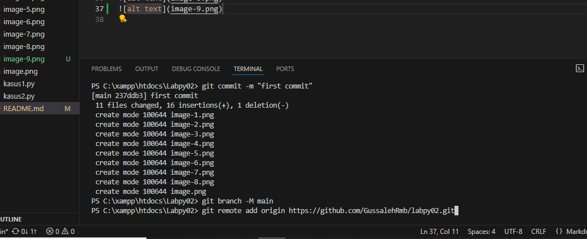
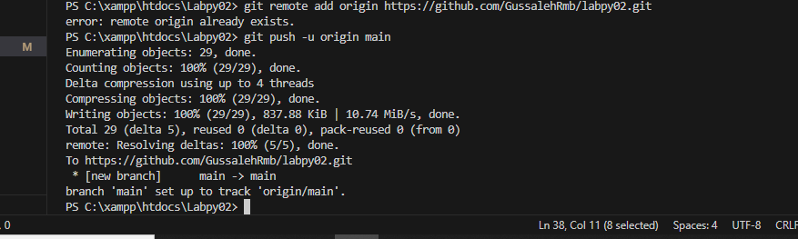
### Setelah push maka project/file kita akan tersimpan di repository GitHub kita
.png>)
# Selesai

