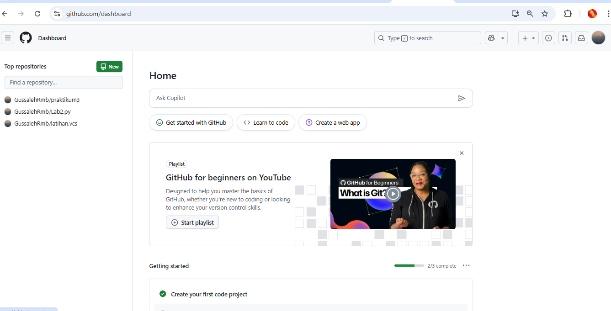
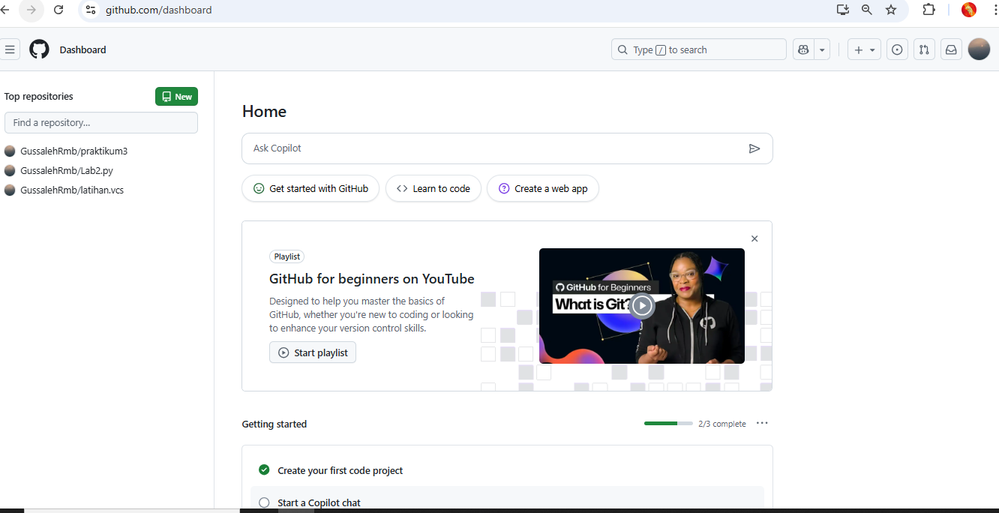

# Kasus 1: Program Pemesanan Tiket Bioskop
## Lankah Lankah Pembuatanya 
### 1. Buatkan folder baru di file manager dengan nama labpy02

### 2. Ketika sudah membuat folder baru, buatkan lagi file baru di folder labpy02 tadi dengan mengklik sehingga masuk, kemudian buatkan file baru di bagian itu, klik bagian new dan tambahkan text dukumen dan gantikan jadi file kasus1.py

### 3. setelah buat folder baru dan filenya, selanjutnya Masuk ke VISUAL STUDIO CODE di laptop 
### Ketika sudah masuk, klik bagian kiri paling atas pada menu file dan buka bagian menu open folder

###  Maka akan masuk ke bagian file manager, cari bagian folder labpy02 yang baru di buat, klik bagian Folder labpy02 dengan sekali klik, kemudian muncul select folder dan klik select folder tersebut.

### 4. Setelah itu file akan tersimpan di VISUAL STUDIO CODE
### dan Buatkan "proram Pemesanan Tiket Bioskop" pada file kasus1.py tersebut

### 5. jalankan programnya di bagian menu run pada VISUAL STUDIO CODE pada bagian atas kanan program, atau masukan kode foldernya di bagian terminal "python labpy02.py"
### Jalankan dan lihat hasil programnya di bagian terminal.

### 6. Gambar flowcart

### Setelah semua selesai Commit dan push pada repository
